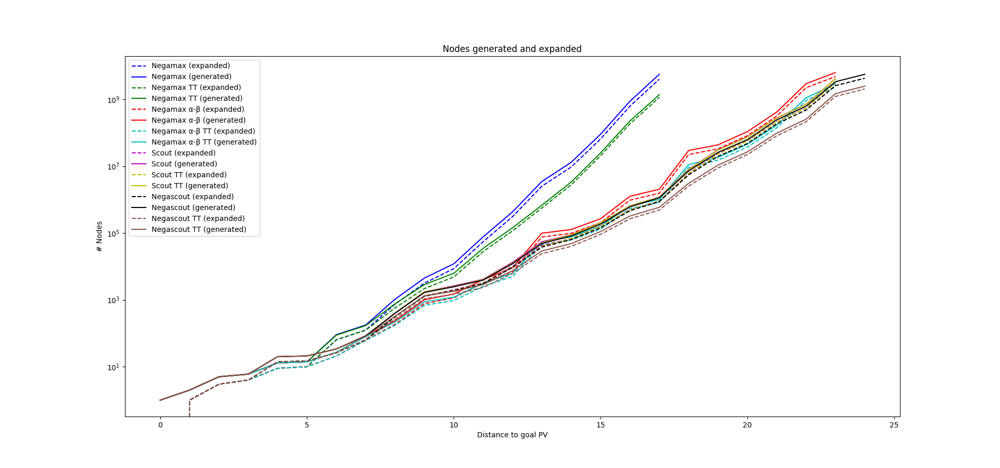
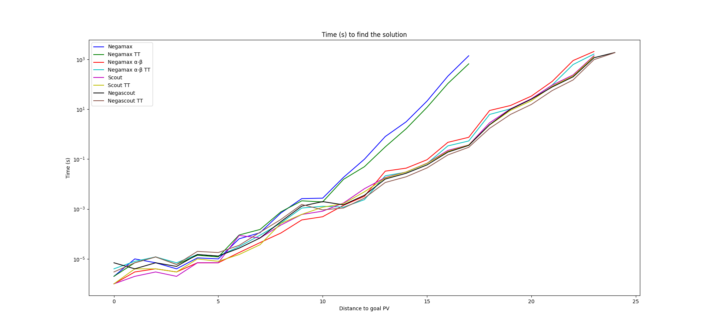

#
### CI5437 - Inteligencia Artificial 1
##### Prof. Carlos Infante

# Proyecto 2

Por <a href='https://www.github.com/chrischriscris'>Chus</a> | <a href='https://www.github.com/fungikami'>K</a>

## 1. Introducción

Una de las cuestiones fundacionales de la Inteligencia Artificial es la de construir agentes capaces de tomar decisiones razonables en un entorno, ya que es esta una de las características que comunmente se asocian a la inteligencia humana. En este sentido, los juegos de tablero (y en particular, los juegos de dos jugadores con información perfecta) son un entorno de interés para la Inteligencia Artificial, ya que son entornos discretos, determinísticos y de suma cero, lo que los hace ideales para el estudio de algoritmos de búsqueda y de estrategias de juego. Lo que se busca con esto es que el agente implementado pueda escoger la mejor jugada en cada turno, y que sea así capaz de ganar, o al menos empatar la partida, contra un oponente humano o contra otro agente.

Por otro lado, Othello se trata de un juego de mesa en el que dos jugadores se enfrentan en un tablero de 8x8. El juego comienza con cuatro fichas colocadas en el centro del tablero, dos de cada color, en una disposición alternada, y el objetivo es tener más fichas de tu color que el oponente al final de la partida. Para ello, los jugadores colocan fichas de su color en el tablero, de tal forma que las fichas del oponente que se encuentren entre dos fichas del jugador, en una misma fila, columna o diagonal, se voltean y pasan a ser del jugador. El juego termina cuando ninguno de los jugadores puede colocar una ficha en el tablero, y el ganador es el jugador con más fichas de su color en el tablero.

Así, el objetivo de este proyecto es el de implementar un agente para una versión simplificada de Othello (con un tablero de 6x6), utilizando los algoritmos de árboles de juego Negamax (con y sin poda alpha-beta), Scout y Negascout, y evaluar su desempeño en la variación principal del juego.

## 2. Detalles de implementación

### 2.1. Representación del juego

Para la versión simplificada de Othello, la representación usada consiste en dos mapa de bits guardados en enteros de 32 bits, en el que cada bit codifica una posición del tablero. Con ello se busca una mayor eficiencia en el uso de la memoria, ya que se utiliza un solo entero de 32 bits para representar el tablero de 36 piezas, aprovechando la forma del problema para guardar las 4 fichas fijas del centro en un entero de 8 bits y desperdiciar solo 4 bits, en lugar de tomar otras estructuras como un arreglo de 36 booleanos o un entero de 64 bits.

Más detalladamente, un estado consiste en 3 campos:

- Un entero de 32 bits, en el que el i-ésimo bit representa la posición i del tablero, exceptuando las 4 centrales, con 0 para las posiciones libres y 1 para las ocupadas.
- Un entero de 32 bits, en el que el i-ésimo bit representa la posición i del tablero, exceptuando las 4 centrales, con 0 para las posiciones ocupadas por las fichas blancas y 1 para las ocupadas por las fichas negras. En caso de que una posición esté libre, el bit correspondiente es 0 por defecto, por lo que se ha de consultar el primer entero para verificar si la posición está libre o no.
- Un entero de 8 bits en el que los 4 bits menos significativos representan las 4 posiciones centrales del tablero, siendo 0 para las posiciones ocupadas por las fichas blancas y 1 para las ocupadas por las fichas negras. Al nunca estar libres, no se necesita otro entero para representar si están ocupadas o no.

Así, se tienen distintos métodos para manipular un estado, en los cuales se emplean operaciones bit a bit para manipular los enteros que lo representan.Estos métodos incluyen:

- Hashing de un estado, para poder almacenar los estados visitados en una tabla de transposición.
- Verificaciones varias: si una posición está ocupada por determinado color, si está libre, si un jugador tiene movimientos válidos, si un estado es terminal, etcétera.
- Modificación del estado colocando una ficha en una posición y volteando consecuentemente las fichas del oponente que se encuentren entre dos fichas del jugador.
- Obtención de los movimientos válidos de un jugador
- Obtención un movimiento válido aleatorio.
- Impresión del estado, tanto en su representación en bits como de una forma legible.

Por ejemplo, para la función que verifica si una posición está ocupada dado un color, se realiza un enmascaramiento de la posición con el entero que representa las piezas ocupadas por el jugador, y se verifica si el resultado es distinto de 0.

Por otro lado, se completaron las verificaciones sobre las diagonales en las funciones `outflank` y `move` del archivo `othello_cut.hpp`. Dichas verificaciones buscan la posición en que se desea colocar la ficha, y verifican si hay fichas del oponente en las diagonales que se forman con las fichas del jugador en la misma fila y columna que la posición en cuestión. En caso de que este seguimiento de fichas del oponente termine en una ficha del jugador, se considera que hay fichas del oponente que se voltearán al colocar la ficha en la posición en cuestión.

Como detalle de implementación, se modificó la función `valid_moves` del archivo `othello_cut.hpp`, que originalmente retornaba un vector con las posiciones en las que el jugador puede colocar una ficha, estando este vacío si no habían movimientos válidos. La modificación consistió en retornar un vector con el elemento `36`, que representa el movimiento de ceder el turno.

### 2.2. Algoritmos de búsqueda

Se implementó los algoritmos de búsqueda Negamax, Negamax con poda alpha-beta, Scout y Negascout en el archivo `main.cpp`:

- Negamax (minmax): Consiste en una variación del algoritmo minimax, utilizando el hecho de que max(a, b) = -min(-a, -b) para simplificar el código. Así, se busca en cada nivel el movimiento que maximice el puntaje del jugador, asumiendo que el oponente también escogerá el movimiento que maximice su puntaje, que será el negativo del puntaje del jugador. De esta forma se elimina la recursión mutua y la verificación de si el nivel es par o impar.

- Negamax con poda alpha-beta: Una optimización del algoritmo anterior en la que se agregan dos parámetros alpha y beta, que representan el puntaje mínimo que el jugador puede garantizar y el puntaje máximo que el oponente puede garantizar, respectivamente. Así, se podan los nodos que no aportan información, es decir, aquellos en los que el puntaje del jugador es menor o igual a alpha o el puntaje del oponente es mayor o igual a beta, eliminando la necesidad de explorar ciertos subárboles enteros.

- Scout: Otra optimización de poda sobre minimax que intenta reducir el número de nodos evaluados mediante la exploración selectiva de los nodos más prometedores. En lugar de explorar todos los nodos en un nivel, el algoritmo Scout examina solo el primer nodo y utiliza su puntaje para decidir si se deben explorar los nodos hermanos. Si el puntaje del primer nodo es mayor que el puntaje actual de alpha, se explora el siguiente nodo hermano. Si es menor que el puntaje actual de beta, se explora el siguiente nodo hermano en sentido contrario. Si el puntaje está entre alpha y beta, se realiza una exploración completa del nodo actual. De esta manera, el algoritmo Scout puede evitar la exploración de subárboles enteros que no aportan información relevante. A pesar de conceptualmente involucrar un alpha y un beta, estas variables no se mantienen en la implementación, lo que la hace más sencilla y elegante.

- Negascout: Una optimización que combina las ideas de Negamax y Scout, realizando una búsqueda similar a la de Scout pero sin prescindir de la poda alpha-beta, trayendo lo mejor de ambos mundos.

Asimismo, para cada uno de los anteriores algoritmos se implementó la posibilidad de usar una tabla de transposición, que almacena los estados visitados y su puntaje, para evitar la evaluación de estados repetidos a lo largo del árbol de búsqueda. Para esto se utilizó la librería `unordered_map` de C++, que implementa una tabla hash, en la que se almacena el estado como clave y el puntaje como valor, además de si se trata de un puntaje exacto, un límite inferior o un límite superior.

Al ser intensiva en el uso de memoria, se intentaron varias técnicas para evitar llenar la memoria, entre ellas:

- Solo almacenar estados hasta 10 niveles de profundidad.
- Solo almacenar estados con valores exactos (saltando los que son límites inferiores o superiores).
- Aprovechar la localidad temporal de los estados visitados, limpiando la tabla entera cada vez que el número de nodos generados supera un cierto umbral n. De tal forma solo se tendrían guardados los últimos n nodos generados.

A pesar de no tener pruebas formales, se observó que la última técnica era la más efectiva, por lo que se utilizó en la implementación final. El umbral que se utilizó fue de 2^18 = 262144 nodos, lo cual hace que el uso de memoria con el ejecutable cargado en la memoria RAM sea de aproximadamente 35MB. Umbrales más altos (por ejemplo, 2^20 o 2^22) no mejoraban el rendimiento (y llegaban a usar de 500MB a >1GB de RAM), y umbrales más bajos hacían que se llenara y vaciara la tabla de transposición constantemente sin que se pudiera aprovechar su efecto.

Una idea que no se terminó de implementar, pero que puede servir para futuras mejoras, es la de implementar una tabla con política de reemplazo LRU (Least Recently Used), que almacene los últimos n estados visitados, eliminando los usados hace más tiempo. Esto podría ser más efectivo que la técnica anterior, ya que se aprovecharía la localidad temporal de los estados visitados, pero sin tener que limpiar la tabla entera cada vez que se llena. Se tendría que evaluar si la complejidad adicional en cómputo y memoria vale la pena.

### 2.3. Evaluación de los algoritmos

Para cada algoritmo, la evaluación se hace comenzando sobre el tablero terminal en la variación principal, y subimos a lo largo de la misma. Cada vez que subimos, volvemos a ejecutar el algoritmo de solución a partir del nodo actual hasta que termine o hasta que el límite de tiempo expire. Se estableció como límite de tiempo de 1 hora por cada algoritmo.

## 3. Resultados experimentales

#### 3.1 Entorno de pruebas
Para la ejecución de los algoritmos se utilizó un computador con las siguientes características:

- **Procesador**: Intel i5-1035G1 (8) @ 3.600GHz.
- **Memoria RAM**: 7689MiB.
- **Sistema operativo**: Pop!_OS 22.04 LTS x86_64.

Por otro lado, los algoritmos de búsqueda fueron implementados en C++, compilados con `g++ <version>` usando las flags `-Ofast -Wall -Wpedantic -std=c++11 -march=native -mtune=native`, buscando la mayor eficiencia posible.

### 3.2 Ejecuciones

Se ejecutó el programa para cada algoritmo de búsqueda, con y sin tabla de transposición (TT), con un límite de tiempo de 1 hora (3600 segundos). Los resultados se muestran en las siguientes tablas:

#### 3.2.1 Negamax

|PV |Color |Valor |Expandidos   |Generados |Tiempo (s) |Generado/segundo|Expandidos (TT) |Generados (TT)|Tiempo (s) (TT) |Generado/segundo (TT)|
|---|------|------|-------------|----------|-----------|----------------|----------------|--------------|----------------|---------------------|
|34 |White |-4    |0            |1         |2.00002e-06|499996          |0               |1             |2.00002e-06     |499996               |
|33 |Black |-4    |1            |2         |1.00001e-05|199998          |1               |2             |7.00005e-06     |285712               |
|32 |White |-4    |3            |5         |7.00005e-06|714280          |3               |5             |1.20001e-05     |416664               |
|31 |Black |-4    |4            |6         |4.00003e-06|1.49999e+06     |4               |6             |5.99981e-06     |1.00003e+06          |
|30 |White |-4    |9            |13        |1.09999e-05|1.18183e+06     |9               |13            |1.40001e-05     |928564               |
|29 |Black |-4    |10           |14        |1.00001e-05|1.39999e+06     |10              |14            |1.20001e-05     |1.16666e+06          |
|28 |White |-4    |64           |91        |6.4e-05    |1.42187e+06     |64              |88            |9.1e-05         |967033               |
|27 |Black |-4    |125          |177       |0.000112   |1.58036e+06     |124             |170           |0.000151        |1.12583e+06          |
|26 |White |-4    |744          |1049      |0.000692   |1.5159e+06      |575             |764           |0.000769        |993498               |
|25 |Black |-4    |3168         |4498      |0.00261    |1.72337e+06     |2177            |2868          |0.002128        |1.34774e+06          |
|24 |White |-4    |8597         |11978     |0.002722   |4.40044e+06     |4850            |6240          |0.001919        |3.25169e+06          |
|23 |Black |-4    |55127        |76826     |0.018603   |4.12976e+06     |27817           |34830         |0.015466        |2.25204e+06          |
|22 |White |-4    |308479       |428402    |0.09876    |4.33781e+06     |116035          |143097        |0.049514        |2.89003e+06          |
|21 |Black |-4    |2525249      |3478735   |0.803039   |4.33196e+06     |563965          |678930        |0.309193        |2.19581e+06          |
|20 |White |-4    |9459570      |13078933  |3.12585    |4.18412e+06     |2777738         |3358759       |1.64556         |2.0411e+06           |
|19 |Black |-4    |65121519     |90647895  |21.2       |4.27584e+06     |20556295        |24868332      |11.8777         |2.0937e+06           |
|18 |White |-4    |625084814    |876269598 |211.649    |4.14021e+06     |185313352       |224890386     |107.177         |2.09831e+06          |
|17 |Black |-4    |3999381161   |5599973387|1389.35    |4.03064e+06     |1139870969      |1378697920    |659.008         |2.09208e+06          |

#### 3.2.2 Negamax con poda alpha-beta

|PV |Color |Valor |Expandidos   |Generados |Tiempo (s) |Generado/segundo|Expandidos (TT) |Generados (TT)|Tiempo (s) (TT) |Generado/segundo (TT)|
|---|------|------|-------------|----------|-----------|----------------|----------------|--------------|----------------|---------------------|
|34 |White |-4    |0            |1         |9.99949e-07|1.00005e+06     |0               |1             |4.00003e-06     |249998               |
|33 |Black |-4    |1            |2         |2.99996e-06|666674          |1               |2             |8.00006e-06     |249998               |
|32 |White |-4    |3            |5         |4.00003e-06|1.24999e+06     |3               |5             |1.20001e-05     |416664               |
|31 |Black |-4    |4            |6         |3.00002e-06|1.99998e+06     |4               |6             |7.00005e-06     |857136               |
|30 |White |-4    |9            |13        |6.99994e-06|1.85716e+06     |9               |13            |1.50001e-05     |866660               |
|29 |Black |-4    |10           |14        |7.00005e-06|1.99998e+06     |10              |14            |1.29999e-05     |1.07693e+06          |
|28 |White |-4    |21           |27        |1.8e-05    |1.5e+06         |21              |27            |3.1e-05         |870968               |
|27 |Black |-4    |62           |82        |4.5e-05    |1.82222e+06     |61              |79            |8.9e-05         |887641               |
|26 |White |-4    |186          |238       |0.000109   |2.18349e+06     |175             |219           |0.000276        |793478               |
|25 |Black |-4    |769          |1003      |0.000365   |2.74795e+06     |688             |872           |0.001093        |797804               |
|24 |White |-4    |1152         |1502      |0.00049    |3.06531e+06     |954             |1205          |0.001286        |937014               |
|23 |Black |-4    |3168         |4068      |0.001406   |2.89331e+06     |2538            |3158          |0.001189        |2.65601e+06          |
|22 |White |-4    |7031         |9130      |0.003229   |2.8275e+06      |4997            |6248          |0.002364        |2.64298e+06          |
|21 |Black |-4    |76021        |98755     |0.032921   |2.99976e+06     |44811           |54847         |0.021444        |2.55768e+06          |
|20 |White |-4    |98129        |127644    |0.043408   |2.94056e+06     |62422           |76622         |0.029955        |2.5579e+06           |
|19 |Black |-4    |205017       |267604    |0.094219   |2.84023e+06     |130373          |160070        |0.066253        |2.41604e+06          |
|18 |White |-4    |960343       |1259430   |0.46992    |2.68009e+06     |536289          |652990        |0.338487        |1.92914e+06          |
|17 |Black |-4    |1549785      |2031924   |0.748841   |2.71342e+06     |829053          |1009303       |0.534095        |1.88974e+06          |
|16 |White |-4    |22325108     |29501798  |8.8875     |3.31947e+06     |9242868         |11154569      |6.18148         |1.80451e+06          |
|15 |Black |-4    |32949019     |43574643  |14.0725    |3.09643e+06     |15139388        |18421041      |10.3538         |1.77916e+06          |
|14 |White |-4    |82016158     |107642871 |33.5341    |3.20995e+06     |37338253        |45177586      |25.4945         |1.77205e+06          |
|13 |Black |-4    |315074162    |415909956 |130.411    |3.18922e+06     |139312414       |168357476     |93.5991         |1.79871e+06          |
|12 |White |-4    |2230058150   |2931981147|892.143    |3.28645e+06     |928343786       |1109988610    |617.523         |1.79748e+06          |
|11 |Black |-4    |4807701319   |6337469561|2064.38    |3.06992e+06     |2336988343      |2845800799    |1624.51         |1.75179e+06          |

#### 3.2.3 Scout

|PV |Color |Valor |Expandidos   |Generados |Tiempo (s) |Generado/segundo|Expandidos (TT) |Generados (TT)|Tiempo (s) (TT) |Generado/segundo (TT)|
|---|------|------|-------------|----------|-----------|----------------|----------------|--------------|----------------|---------------------|
|34 |White |-4    |0            |1         |9.99775e-07|1.00023e+06     |0               |1             |1.00001e-06     |999992               |
|33 |Black |-4    |1            |2         |2.00002e-06|999992          |1               |2             |4.00003e-06     |499996               |
|32 |White |-4    |3            |5         |3.00002e-06|1.66665e+06     |3               |5             |3.99991e-06     |1.25003e+06          |
|31 |Black |-4    |4            |6         |2.00002e-06|2.99998e+06     |4               |6             |3.00002e-06     |1.99998e+06          |
|30 |White |-4    |14           |20        |7.00005e-06|2.85712e+06     |14              |20            |9.99996e-06     |2.00001e+06          |
|29 |Black |-4    |15           |21        |6.99982e-06|3.00008e+06     |15              |21            |7.99994e-06     |2.62502e+06          |
|28 |White |-4    |26           |34        |8.7e-05    |390805          |26              |34            |1.5e-05         |2.26667e+06          |
|27 |Black |-4    |64           |84        |6.90001e-05|1.21739e+06     |64              |84            |3.69999e-05     |2.27027e+06          |
|26 |White |-4    |314          |401       |0.000228   |1.75877e+06     |314             |401           |0.000265        |1.51321e+06          |
|25 |Black |-4    |1334         |1748      |0.000604   |2.89404e+06     |1331            |1741          |0.00061         |2.8541e+06           |
|24 |White |-4    |2011         |2622      |0.000819   |3.20146e+06     |1935            |2517          |0.001178        |2.13667e+06          |
|23 |Black |-4    |3232         |4141      |0.001739   |2.38125e+06     |3156            |4036          |0.001638        |2.46398e+06          |
|22 |White |-4    |10214        |13285     |0.006497   |2.04479e+06     |9642            |12507         |0.004879        |2.56344e+06          |
|21 |Black |-4    |42358        |54461     |0.018269   |2.98106e+06     |39784           |50989         |0.017423        |2.92653e+06          |
|20 |White |-4    |68853        |89091     |0.030527   |2.91843e+06     |68289           |88287         |0.03034         |2.90992e+06          |
|19 |Black |-4    |157458       |204351    |0.068617   |2.97814e+06     |156848          |203474        |0.067004        |3.03674e+06          |
|18 |White |-4    |497954       |649026    |0.224062   |2.89664e+06     |493207          |642454        |0.205089        |3.13256e+06          |
|17 |Black |-4    |911296       |1189883   |0.369272   |3.22224e+06     |906372          |1183042       |0.367856        |3.21605e+06          |
|16 |White |-4    |6096169      |7989969   |2.8535     |2.80006e+06     |5949863         |7793878       |2.33417         |3.33904e+06          |
|15 |Black |-4    |23572285     |30953399  |10.3007    |3.00498e+06     |23013277        |30208222      |8.97071         |3.36743e+06          |
|14 |White |-4    |57114374     |74581266  |26.2928    |2.83657e+06     |56248385        |73429130      |21.847          |3.36107e+06          |
|13 |Black |-4    |211427675    |276935284 |92.1048    |3.00674e+06     |209977477       |275001667     |83.1237         |3.30834e+06          |
|12 |White |-4    |545805549    |713350259 |237.417    |3.00464e+06     |541827904       |708040127     |218.154         |3.2456e+06           |
|11 |Black |-4    |3146084778   |4121863467|1398.54    |2.94727e+06     |3118360579      |4084809336    |1301.4          |3.13878e+06          |

#### 3.2.4 Negascout

|PV |Color |Valor |Expandidos   |Generados |Tiempo (s) |Generado/segundo|Expandidos (TT) |Generados (TT)|Tiempo (s) (TT) |Generado/segundo (TT)|
|---|------|------|-------------|----------|-----------|----------------|----------------|--------------|----------------|---------------------|
|34 |White |-4    |0            |1         |7.00005e-06|142856          |0               |1             |3.00002e-06     |333331               |
|33 |Black |-4    |1            |2         |4.00003e-06|499996          |1               |2             |7.00005e-06     |285712               |
|32 |White |-4    |3            |5         |7.00005e-06|714280          |3               |5             |1.19999e-05     |416672               |
|31 |Black |-4    |4            |6         |5.00004e-06|1.19999e+06     |4               |6             |6.00005e-06     |999992               |
|30 |White |-4    |14           |20        |1.50001e-05|1.33332e+06     |14              |20            |1.99999e-05     |1e+06                |
|29 |Black |-4    |15           |21        |1.29999e-05|1.6154e+06      |15              |21            |1.79999e-05     |1.16667e+06          |
|28 |White |-4    |26           |34        |2.7e-05    |1.25926e+06     |26              |34            |3.5e-05         |971428               |
|27 |Black |-4    |64           |84        |6.90001e-05|1.21739e+06     |63              |81            |0.000117        |692307               |
|26 |White |-4    |312          |398       |0.000312   |1.27564e+06     |267             |325           |0.000381        |853018               |
|25 |Black |-4    |1275         |1668      |0.001306   |1.27718e+06     |1079            |1323          |0.001526        |866972               |
|24 |White |-4    |1894         |2465      |0.00198    |1.24495e+06     |1467            |1798          |0.000924        |1.94589e+06          |
|23 |Black |-4    |3051         |3898      |0.00147    |2.6517e+06      |2357            |2866          |0.001095        |2.61735e+06          |
|22 |White |-4    |9329         |12085     |0.003537   |3.41674e+06     |6137            |7438          |0.002725        |2.72954e+06          |
|21 |Black |-4    |37988        |48716     |0.015878   |3.06814e+06     |24126           |29037         |0.011565        |2.51077e+06          |
|20 |White |-4    |63570        |81896     |0.027005   |3.03262e+06     |40023           |48233         |0.019545        |2.46779e+06          |
|19 |Black |-4    |142595       |184434    |0.058491   |3.1532e+06      |91449           |110585        |0.044311        |2.49566e+06          |
|18 |White |-4    |466161       |606535    |0.191107   |3.1738e+06      |266184          |321658        |0.147364        |2.18274e+06          |
|17 |Black |-4    |870050       |1134974   |0.354377   |3.20273e+06     |487535          |587808        |0.297635        |1.97493e+06          |
|16 |White |-4    |5518091      |7224096   |2.39783    |3.01277e+06     |2537936         |3056912       |1.71054         |1.78711e+06          |
|15 |Black |-4    |19705373     |25834398  |9.93678    |2.59988e+06     |8886003         |10750596      |6.17039         |1.74229e+06          |
|14 |White |-4    |47600678     |62054622  |25.2037    |2.46212e+06     |22148464        |26721532      |15.5305         |1.72058e+06          |
|13 |Black |-4    |185297022    |242590597 |77.9896    |3.11055e+06     |80916215        |97281583      |55.9763         |1.73791e+06          |
|12 |White |-4    |477003110    |623022874 |198.926    |3.13193e+06     |212030721       |254362068     |148.95          |1.7077e+06           |
|11 |Black |-4    |2569424777   |3362315471|1155.14    |2.91075e+06     |1217566748      |1475131666    |970.25          |1.52036e+06          |
|10 |White |-4    |4286714291   |5619692615|1873.28    |2.99992e+06     |2045916485      |2485717464    |1844.62         |1.34755e+06          |

### 3.3 Comparación de los algoritmos

De los resultados obtenidos anteriormente, se tienen los siguientes valores mínimos de la variación principal alcanzados por cada algoritmo:

| Algoritmo        | PV |Expandidos   |Generados |Tiempo (s) |Generado/segundo|Expandidos (TT) |Generados (TT)|Tiempo (s) (TT) |Generado/segundo (TT)|
|------------------|----|-------------|----------|-----------|----------------|----------------|--------------|----------------|---------------------|
| Negamax          |17  |3999381161   |5599973387|1389.35    |4.03064e+06     |1139870969      |1378697920    |659.008         |2.09208e+06          | 
| Negamax con poda |11  |4807701319   |6337469561|2064.38    |3.06992e+06     |2336988343      |2845800799    |1624.51         |1.75179e+06          | 
| Scout            |11  |3146084778   |4121863467|1398.54    |2.94727e+06     |3118360579      |4084809336    |1301.4          |3.13878e+06          |
| Negascout        |10  |4286714291   |5619692615|1873.28    |2.99992e+06     |2045916485      |2485717464    |1844.62         |1.34755e+06          |

En la siguiente gráfica se muestran los nodos expandidos y generados de cada algoritmo, con y sin tabla de transposición.
 
 

Como también, se muestra el tiempo de ejecución de cada algoritmo, con y sin tabla de transposición.

Al observar las tablas y la gráfica, se tiene que el algoritmo de Negamax fue el que presentó el peor rendimiento entre los algoritmos de búsqueda, al llegar hasta un valor mínimo de la variación principal de 17 con 3999381161 (3.9E9) nodos expandidos sin tabla de transposición, mientras que al mismo nivel de la PV usando poda alpha-beta se reduce notoriamente el número de nodos expandidos del algoritmo, con 1549785 (1.5E6) nodos. Asimismo, el uso de una tabla de transposición para ambos algoritmos reduce de forma significativa el número de nodos computados a medida que se llega más lejos de la variación principal del juego, con 1139870.969 (1.1E9) vs. 829053 (8.2E5) al mismo estado de la PV, respectivamente. Además, se puede observar que el algoritmo de Negamax con poda alpha-beta presenta un rendimiento superior al algoritmo de Negamax, al alcanzar un valor mínimo de la variación principal de 11 con 4807701319 (4.8E9) nodos expandidos.

Por otro lado, se puede observar que Scout y Negascout presentan un rendimiento superior que el algoritmo de Negamax, al alcanzar un valor mínimo de la variación principal de 11 y 10, con aproximadamente 3.1E9 y 4.2E9 nodos generados, respectivamente. No obstante, para el algoritmo de Scout, las tablas de transposición no presentan una reducción significativa de los nodos expandidos y generados. Esto se puede ver en la figura, al solaparse las líneas de los nodos expandidos y generados con y sin tabla de transposición. Por otro lado, para el algoritmo de Negascout se puede observar que las tablas de transposición reducen el número de nodos expandidos y generados, al alcanzar un valor mínimo de la variación principal de 10 y 2E9 nodos expandidos al mismo nivel de la PV.

No obstante, si bien las tablas de transposición reducen el número de nodos expandidos y generados, estos no presentan una mejora al querer buscar el algoritmo que presente la variación principal más pequeña. Además, presentan un mayor uso de memoria al tener que almacenar los nodos ya visitados.

Ahora, con respecto al tiempo de ejecución, los resultados son los esperados, siendo los algoritmos con poda más eficientes que los que no la tienen, y los que usan tablas de transposición más eficientes que los que no las usan. Para este problema específico, parece que la poda Scout resulta más eficaz que la poda alpha-beta, sin embargo, esto no es necesariamente cierto para todos los problemas. En este caso, tomando como referencia el nivel 12 de las PV, la poda Scout logra expandir todo el árbol tomándose casi 11 minutos menos que la poda alpha-beta y generando aproximadamente 2200 millones de nodos menos. En el mismo orden de ideas, el Negascout logra mejorar esto aún más ahorrándose alrededor de 90 millones de nodos expandidos y 40 segundos de tiempo de ejecución para el mismo nivel de la PV.

En el otro espectro, el negamax base sin poda no logra superar el nivel 17 en 1 hora de ejecución, mientras que todos los demás algoritmos que incorporan poda superan este nivel en menos de 1 segundo, en oposición a los 21 minutos de este algoritmo.

Por último, vale la pena apuntar que, aunque en todos los casos el uso de la tabla de transposición reduce la cantidad de nodos que se generan por segundo (incluso a la mitad), esto es capaz igualmente de reducir el tiempo de ejecución en todos los casos, lo cual es un resultado interesante, y se explica con que el cómputo utilizado para mantener la tabla de transposición logra superar el tiempo que se ahorra al no tener que expandir y generar los nodos que ya se han visitado, lo cual pesa en unos casos más que en otros. En el caso del Negamax, por ejemplo, el tiempo de ejecución se ve reducido a la mitad en el nivel 17, y la cantidad de nodos generados y expandidos se reduce a más de la mitad. En los casos más eficaces, como el Negamax con poda alpha-beta en el nivel 12, el tiempo se reduce en un ~76%, pero luego otros casos como el Negascout en el nivel 10, el tiempo se reduce en menos de un 2%, siendo sin embargo el algoritmo que más lejos llega en la PV y generando la menor cantidad de nodos (menos de 2100 millones, seguido por su versión sin tabla de transposición con más de 5000 millones). Mientras que la versión más ingenua de los algoritmos supera por 5 veces el umbral de los 1000 millones de nodos generados al nivel 17, la más eficaz y eficiente logra subir 6 niveles más apenas superando el millardo de nodos generados.

## 4. Conclusiones

- Completar